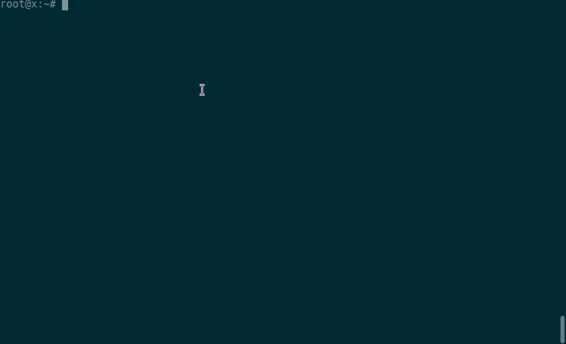

# GRPCDump
Tool for capture and decode GRPC messages from ethernet traffic

[](https://travis-ci.com/rmedvedev/grpcdump) [](https://goreportcard.com/report/github.com/rmedvedev/grpcdump) [](https://codecov.io/gh/rmedvedev/grpcdump)

## Demo



## Installation / Getting started

Installation is supported only on Linux and does not require additional dependencies such as libpcap-dev

```bash
go run cmd/grpcdump/main.go
```
### From Source

```bash
go get -u github.com/rmedvedev/grpcdump/...
cp $(go env GOPATH)/bin/grpcdump /usr/local/bin
grpcdump 
```

## Usage 

The next option explains usage doc
```bash
grpcdump -help
```
For example, to capture grpc traffic, parse grpc request and response you need to use this command:
```bash
grpcdump -i lo -p 50051 -proto-path ./grpc/protofiles -proto-files helloworld.proto 
```